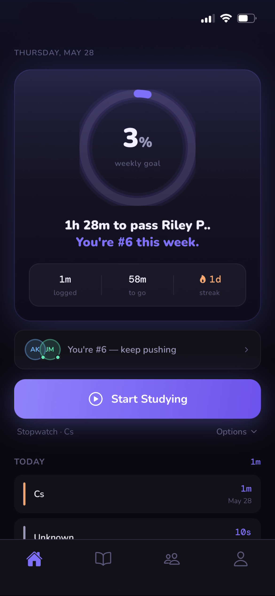
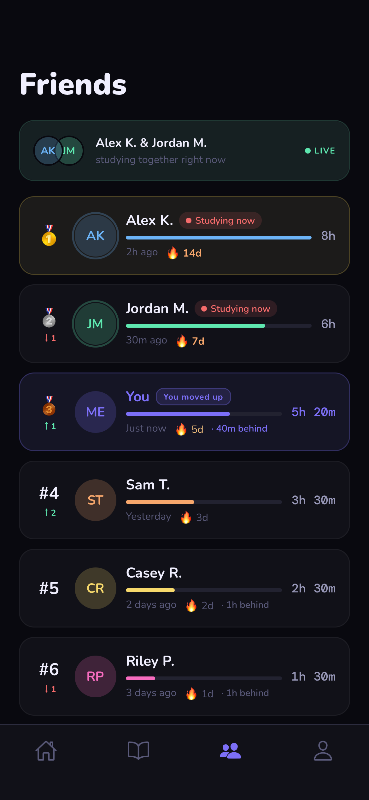
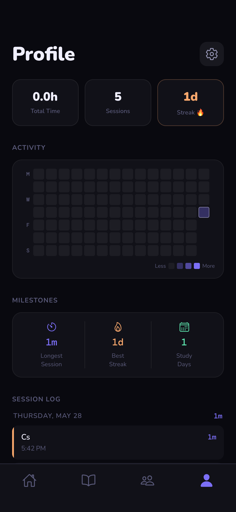
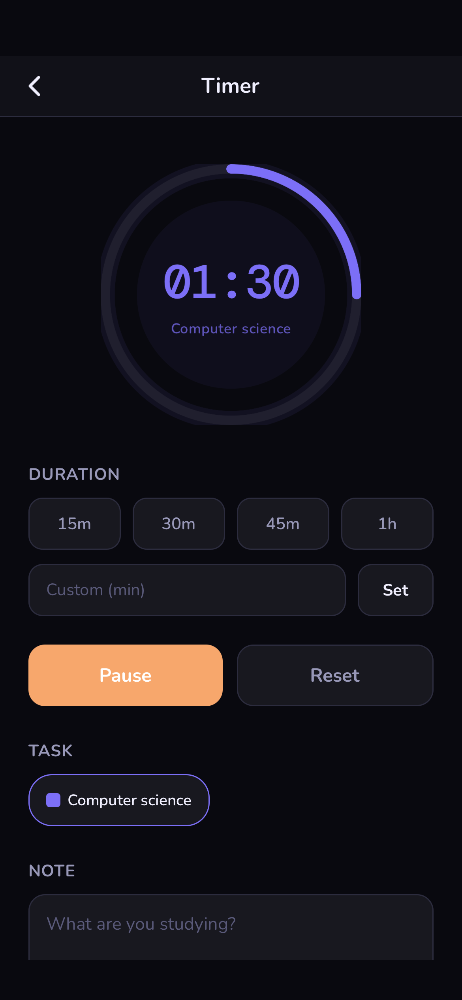

# Lokt

A mobile app for students to log study sessions, track weekly goals, and compete on leaderboards with friends and classmates.

<p align="center">
  
  
  
  
</p>

## Overview

Lokt was built to make individual study habits social. Students log sessions with a stopwatch or countdown timer, tag them to custom subjects, and see how their weekly study time compares to friends in real time. School-wide leaderboards are gated behind verified university email enrollment.

## Features

- Stopwatch and countdown timer with task tagging and session notes
- Per-task weekly goal tracking with animated progress bars
- Friends leaderboard with live presence indicators
- School leaderboard with OTP-verified university enrollment
- 14-week activity heatmap, streak tracking, and full session history
- Focus mode — hides the task picker and note input while a session is running
- Session guard — prompts to save or discard when navigating away mid-session

## Tech Stack

- **React Native + Expo SDK 54** — mobile framework
- **Expo Router v6** — file-based navigation
- **TypeScript** — end to end
- **Supabase** — PostgreSQL database, Auth, Realtime subscriptions
- **Nunito + DM Mono** — typography

## Architecture

**Auth and RLS.** Supabase Auth issues JWTs on login. Every Supabase query from the client automatically attaches the user's JWT, and PostgreSQL Row Level Security policies enforce per-user data access at the database level — no application-level enforcement is required. Leaderboard queries that need to join across tables use `security definer` RPC functions, which run with elevated permissions but return only controlled result sets.

**Store layer.** All database access is isolated in `store/`. Screen components call typed async functions (`getSessions()`, `createTask()`) and receive plain TypeScript objects. The UI layer has no direct Supabase dependency.

**Real-time presence.** When a session starts, the app upserts a row in the `presence` table. The home and friends screens subscribe to `postgres_changes` on that table via Supabase Realtime. Any change triggers a leaderboard re-fetch, updating live indicators across all connected clients without polling.

**School verification.** Users with a personal email can join a school leaderboard by verifying a university address. The app sends a Supabase OTP to the school email, saves the current session tokens, temporarily switches to the OTP session to call a `security definer` RPC that validates the email domain and updates the user's `school_id`, then restores the original session via `supabase.auth.setSession()`. The school email is never stored.

**Signup triggers.** A `BEFORE INSERT` trigger on `profiles` checks the new user's email domain against the `schools` table and auto-assigns `school_id` at signup if there is a match. A separate trigger creates the `profiles` row from the metadata passed during sign-up.

## Project Structure

```
app/
  (tabs)/         Bottom tab screens: Home, Subjects, Friends, Profile
  _layout.tsx     Root layout — auth guard, session listener, font loading
  stopwatch.tsx   Stopwatch screen with navigation guard
  timer.tsx       Countdown timer screen with navigation guard
  task-detail.tsx Per-task detail, goal editor, and session log
  settings.tsx    Weekly goal and notification preferences

store/
  sessions.ts     CRUD for study sessions
  tasks.ts        CRUD for user-created tasks
  social.ts       Leaderboard, friends, presence, school, profile, verification
  settings.ts     Weekly goal persistence
  lastStart.ts    Persists the last used timer mode and task selection

constants/
  colors.ts       Design token palette

types/
  index.ts        Shared TypeScript types

utils/
  supabase.ts     Supabase client initialisation, getUserId(), generateId()
  SessionRing.tsx Animated SVG progress ring used in timer screens
  ScalePressable  Spring-animated pressable wrapper
  notifications   Local notification scheduling (not yet wired to call sites)
```

## Setup

**Prerequisites:** Node.js 18+, Expo CLI, a Supabase project.

```sh
git clone https://github.com/dandreae/Lokt.git
cd Lokt
npm install
cp .env.example .env   # fill in your Supabase URL and anon key
npx expo start
```

The Supabase project requires tables (`profiles`, `sessions`, `tasks`, `presence`, `friendships`, `schools`, `settings`), RLS policies, RPC functions (`get_friends_leaderboard`, `get_school_leaderboard`, `claim_school_membership`), and two triggers. SQL migrations are not yet included in this repository.

## Future Improvements

- Wire up push notifications — `utils/notifications.ts` has all notification functions and copy written; `expo-notifications` still needs to be installed and called at the appropriate trigger points
- Generate Supabase TypeScript types from the database schema to replace manual type mappings in the store layer
- Split `store/social.ts` into domain-specific files (`friends.ts`, `profile.ts`, `schools.ts`)
- Extract inline components from large screen files into a shared `components/` directory
- Include SQL migration files in the repository
